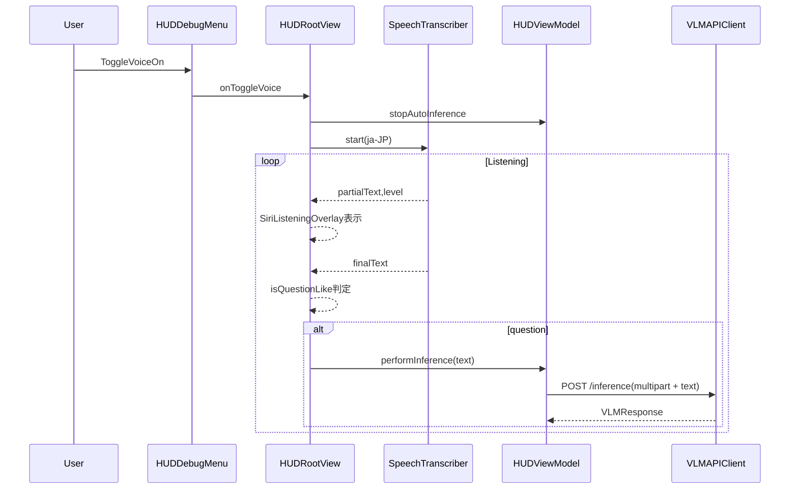

# 音声入力モード（Siri風エフェクト）追加プラン

## 目的

- 右上の3点ドット（`#if DEBUG`のまま）から**音声入力モード**を起動できるようにする。
- 音声入力モード中は**自動推論（4秒ごとのVLM）を停止**する。
- 音声を**日本語で文字起こし**し、**質問と判断したら自動送信**で画像解析API（`POST /inference`）を叩く。
- 音声入力中は画面周囲に**Siri風のAIっぽいエフェクト**を表示する。
- 送信後も**聞き続ける**（連続質問可能）。
- 質問テキスト表示は**音声モード中は常に表示し、確定後もしばらく残す**。

## 仕様の根拠（API）

- `POST /inference` は `multipart/form-data` で `text`（nullable）を受け付ける（Swagger）: [FastAPI - Swagger UI](https://app-54c362a6-dce4-4819-9c60-2ce0d0024e46.ingress.apprun.sakura.ne.jp/docs)

## 実装方針（構成）

- **音声認識**: `Speech` + `AVAudioEngine` でストリーミング文字起こし（partial/final）。
- **エフェクト**: `HUDRootView` の最上位 `ZStack` に全画面Overlay（角丸ストローク＋グロー、音量レベル連動）。
- **質問判定**: `？/?` または簡易キーワード（何/どこ/いつ/ですか…）で判定。
- **送信制御**: final が来たタイミングで質問判定→自動送信。
  - 連続送信の暴発防止として `isSending` フラグ + クールダウン（例: 1–2秒）を入れ、送信中のfinalは無視。
- **自動推論停止**: 音声モードON時に `HUDViewModel.stopAutoInference()`。
  - 音声モードOFF時のみ、元々ONだった場合に `startAutoInference()` で復帰。

## 変更する主なファイル

- 権限
  - [`arglass/ArGlass/Resources/Info.plist`](arglass/ArGlass/Resources/Info.plist)（`NSMicrophoneUsageDescription` / `NSSpeechRecognitionUsageDescription`）
- 新規追加
  - [`arglass/ArGlass/Services/SpeechTranscriber.swift`](arglass/ArGlass/Services/SpeechTranscriber.swift)
  - [`arglass/ArGlass/Views/Effects/SiriListeningOverlay.swift`](arglass/ArGlass/Views/Effects/SiriListeningOverlay.swift)
  - [`arglass/ArGlass/Views/HUD/HUDQueryBarView.swift`](arglass/ArGlass/Views/HUD/HUDQueryBarView.swift)（音声モード中のTextField表示）
- 既存改修
  - [`arglass/ArGlass/Services/ServiceProtocols.swift`](arglass/ArGlass/Services/ServiceProtocols.swift)（`inferLandmark(..., text: String?)` を追加）
  - [`arglass/ArGlass/Services/VLMAPIClient.swift`](arglass/ArGlass/Services/VLMAPIClient.swift)（multipartに `text` を追加）
  - [`arglass/ArGlass/ViewModel/HUDViewModel.swift`](arglass/ArGlass/ViewModel/HUDViewModel.swift)（`performInference(text:)` 追加）
  - [`arglass/ArGlass/Views/Debug/HUDDebugMenu.swift`](arglass/ArGlass/Views/Debug/HUDDebugMenu.swift)（音声入力の開始/停止項目を追加）
  - [`arglass/ArGlass/Views/HUD/HUDRootView.swift`](arglass/ArGlass/Views/HUD/HUDRootView.swift)（Overlay表示、音声モード制御、質問自動送信、TextField表示）
  - [`arglass/ArGlassTests/Helpers/MockServices.swift`](arglass/ArGlassTests/Helpers/MockServices.swift)（Protocol変更追従）

## 実装ステップ

1. `Info.plist` にマイク/音声認識の利用目的文言を追加し、XcodeのCapabilityでSpeech Recognitionを有効化。
2. `SpeechTranscriber` を追加（partial/final + 音量レベル）。
3. `SiriListeningOverlay` を追加（レベル連動、全画面Overlay）。
4. API層を `text` 対応に拡張（`ServiceProtocols` / `VLMAPIClient` / mocks）。
5. `HUDViewModel.performInference(text:)` を追加し、`VLMAPIClient.inferLandmark(..., text:)` を呼ぶ。
6. `HUDDebugMenu` に「Start/Stop voice input」を追加（DEBUGのみ）。
7. `HUDRootView` に音声モード状態を保持し、

   - ON: `stopAutoInference()` + `speech.start()` + Overlay/TextField表示
   - final受信: 質問なら自動送信（送信中ガード）
   - OFF: `speech.stop()` +（元々自動推論ONなら）`startAutoInference()`

8. 表示要件（音声中はTextField常時、送信後も一定時間保持）を満たすため、送信後に`queryText`をタイマーでクリア（例: 8–15秒）する。

## 動作確認

- シミュレータ/実機で
  - マイク許可→音声認識が開始される
  - 音声中に自動推論が止まる（ログ/状態で確認）
  - 質問文で `text` 付きの`/inference`が1回飛ぶ（ネットワークログ）
  - 送信後も聞き続ける（次の質問でも送信される）
  - `#if DEBUG` のため、リリースUIに影響がない